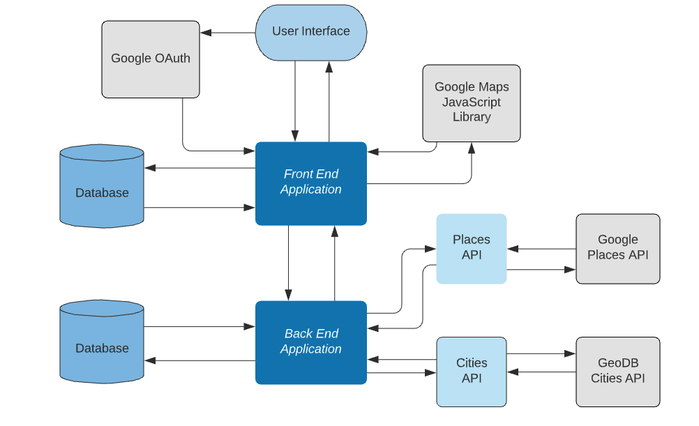
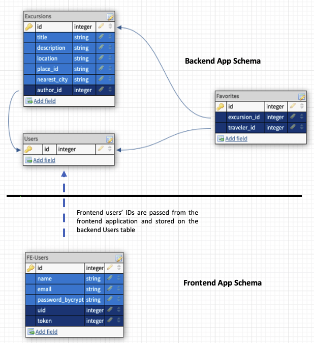

# Go Local: Backend


## Table of Contents

-   [Description](#description)
-   [System Design](#database-schema)
-   [Database Schema](#database-schema)
-   [API Contract](#api-contract)
-   [Technologies Used](#technologies-used)
-   [Local Setup](#local-setup)
-   [Learning Goals](#learning-goals)
-   [Authors](#authors)
-   [Statistics](#statistics)

## Description
Go Local allows travelers to experience their destinations like a local by inviting local users to suggest authentic travel experiences for visitors to enjoy. The app follows a Service-Oriented Architecture pattern and consists of:
  - a [front-end Rails application](https://github.com/Team-Go-Local/go_local_frontend), which provides a user interface;
  - a back-end Rails application, which manages the app's database;
  - a [Sinatra Places micro-service application](https://github.com/Team-Go-Local/go_local_micro-service) to retrieve information from the Google Places API;
  - and a [Sinatra Cities micro-service application](https://github.com/Team-Go-Local/go_local_cities_api), which retrieves the nearest large city to destinations added by our users.<br>

This repository houses the back-end Rails app.

### To view the deployed application, please visit [Go Local](https://go-local-fe.herokuapp.com) on Heroku

## System Design


## Database Schema



## API Contract

This portion of the application exposes 12 endpoints that allow our front-end application to access our app's database. The back-end app also acts as an intermediary between the front-end app and the Cities and Places micro-services. The responses adhere to the [JSON:API v1.0 specifications](https://jsonapi.org/).

- `GET /api/v1/excursions`: gets excursions for a traveler to browse<br>
  - optional parameters: `city` (a string in the format of City, ST for limiting results to within 100 miles of the queried city)
  - example query without city parameter: http://go-local-be.herokuapp.com/api/v1/excursions
  - example query with city parameter: http://go-local-be.herokuapp.com/api/v1/excursions?city=Denver,%20CO
  - example response:
  ```
  {
      "data": [
          {
              "id": "1",
              "type": "excursion",
              "attributes": {
                  "title": "Cabrini Bridge",
                  "description": "Great spot to enjoy a picnic",
                  "location": "Harding Dr, New Orleans, LA 70119",
                  "user_id": 1,
                  "place_id": null,
                  "nearest_city": "New Orleans, LA"
              }
          },
          {
              "id": "2",
              "type": "excursion",
              "attributes": {
                  "title": "Torchy's Tacos",
                  "description": "Get the breakfast tacos",
                  "location": "1085 N Broadway, Denver, CO 80203",
                  "user_id": 3,
                  "place_id": null,
                  "nearest_city": "Denver, CO"
              }
          },
          {
              "id": "3",
              "type": "excursion",
              "attributes": {
                  "title": "Buffalo Bill Museum",
                  "description": "Haunted museum",
                  "location": "987 1/2 Lookout Mountain Rd, Golden, CO 80401",
                  "user_id": 3,
                  "place_id": null,
                  "nearest_city": "Denver, CO"
              }
          }
      ],
      "meta": {
          "cities": [
              "Denver, CO",
              "New Orleans, LA"
          ]
      }
    }
  ```

- `GET /api/v1/excursions/:id`: gets detailed information about an excursion
  - example query: http://go-local-be.herokuapp.com/api/v1/excursions/8
  - example response:
```
{
    "data": {
        "id": "8",
        "type": "excursion_details",
        "attributes": {
            "id": 8,
            "title": "Museum of Contemporary Art Denver",
            "description": "admission is 1 penny on Saturdays for Colorado residents",
            "updated_at": "2021-03-04T21:16:33.100Z",
            "place_id": "ChIJvcHQQcF4bIcRmDttJRd0FN4",
            "nearest_city": null,
            "formatted_address": "1485 Delgany St, Denver, CO 80202, USA",
            "name": "Museum of Contemporary Art Denver",
            "types": [
                "tourist_attraction",
                "museum",
                "point_of_interest",
                "establishment"
            ],
            "phone_number": "(303) 298-7554",
            "website": "http://www.mcadenver.org/",
            "business_status": "OPERATIONAL",
            "opening_hours": [
                "Monday: Closed",
                "Tuesday: 12:00 – 7:00 PM",
                "Wednesday: 12:00 – 7:00 PM",
                "Thursday: 12:00 – 7:00 PM",
                "Friday: 12:00 – 7:00 PM",
                "Saturday: 10:00 AM – 5:00 PM",
                "Sunday: 10:00 AM – 5:00 PM"
            ]
        }
      }
  }
```

###### Additional endpoints:

- `POST /api/v1/users/:id`: adds a user to the database when a new user registers.
- `GET /api/v1/:user_id/excursions`: gets all of the excursions created by the user
- `POST /api/v1/:user_id/excursions`: creates a new excursion; this action includes a request from the back-end to the Cities micro-service to locate the nearest metropolitan area
- `PATCH /api/v1/:user_id/excursions`: updates an existing excursion
- `DELETE /api/v1/:user_id/excursions`: deletes an excursion
- `GET /api/v1/:user_id/favorites`: gets all of the excursions which the user has marked as favorites
- `POST /api/v1/:user_id/favorites/:excursion_id`: records an excursion as a user's 'favorite' by creating a record in the favorites table
- `DELETE /api/v1/:user_id/favorites/:excursion_id`: removes an excursion from the user's favorites by deleting the record from the favorites table
- `GET /api/v1/place_search`: passes a search request from the front-end to the Places micro-service, and returns the micro-service's response to the front-end
- `GET /api/v1/place_details`: passes a request for detailed information about a business or location from the front-end to the Places micro-service, and returns the micro-service's response to the front-end

## Technologies Used
- Rails v. 5.2.4
- Ruby v. 2.5.3
- PostgreSQL
- Heroku
- Travis-CI
- Dependencies:
  - Faraday
  - Fast JSON API
- Testing tools:
  - RSpec
  - FactoryBot
  - Faker
  - SimpleCov
  - Webmock
  - VCR

## Local Setup
  To use the project in your local environment, please follow the instructions below:

  1. Clone the repository:<br>
    `git clone git@github.com:Team-Go-Local/go_local_backend.git`
    `cd go_local_backend`
  2. Install gem packages<br>
    `bundle install`
  3. Create the database<br>
    `rails db:{create,migrate}`
  4. To launch a local server:<br>
    `rails s`<br>
    Once the server is running you can send requests to `localhost:3000`<br>
    ex: `http://localhost:3000/api/v1/excursions`
  5. To run tests and view the test coverage report:<br>
    `bundle exec rspec`  
    `open coverage/index.html`

## Learning Goals

- Utilize a Service-Oriented Architecture with a front-end, a back-end, and at least one micro-service
- Consume external APIs
- Build APIs that return JSON responses
- Use an external OAuth provider to authenticate users
- Deploy a production-quality user interface
- Implement an Agile workflow, including sprint planning & reviews and use of GitHub project management & code review tools

## Authors
-   Cydnee Owens | [github](https://github.com/cowens87) \| [linkedin](https://www.linkedin.com/in/cydnee-owens-5280/)
-   Gus Cunningham | [github](https://github.com/cunninghamge) \| [linkedin](https://www.linkedin.com/in/grayson-cunningham/)
-   Isabelle Villasenor | [github](https://github.com/isabellevillasenor) \| [linkedin](https://www.linkedin.com/in/isabelle-villasenor/)
-   Saundra Catalina | [github](https://github.com/saundracatalina) \| [linkedin](https://www.linkedin.com/in/saundra-catalina/)
-   Sam Yeo | [github](https://github.com/SK-Sam) \| [linkedin](https://www.linkedin.com/in/samuel-horishin-yeo/)
-   V Arruda | [github](https://github.com/nessaarruda) \| [linkedin](https://www.linkedin.com/in/vanessa-alves-de-arruda/)
-   Yesi Meza | [github](https://github.com/Yesi-MC) \| [linkedin](https://www.linkedin.com/in/yesimeza/)

## Statistics
<!-- Shields -->


